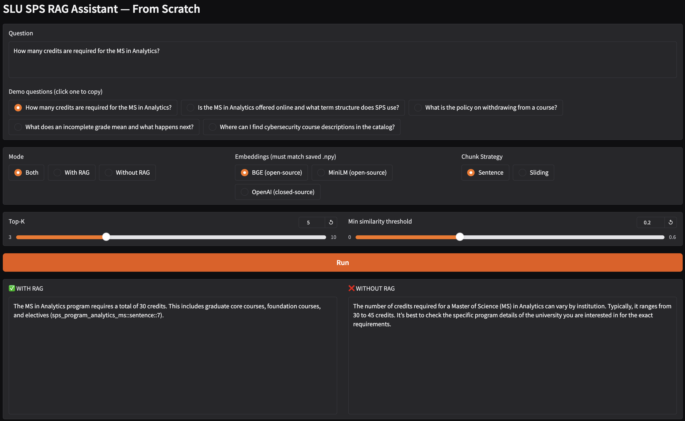

# SPS RAG System (Program Information Assistant)

This project implements a Retrieval-Augmented Generation (RAG) system to answer questions about Saint Louis University’s School for Professional Studies (SPS) programs, policies, and course structure using official documents.

The goal of this project is to move beyond generic LLM responses and generate answers grounded in real university documentation with clear supporting context.

---

## 📌 Project Overview

This system:

* Ingests official SPS PDF documents
* Extracts and cleans raw text
* Applies multiple chunking strategies (sentence-based, sliding window)
* Generates embeddings using:

  * BGE (BAAI/bge-small-en-v1.5)
  * MiniLM (all-MiniLM-L6-v2)
  * OpenAI embeddings
* Compares retrieval approaches:

  * NumPy-based similarity search
  * FAISS vector search
* Uses retrieved context to generate grounded answers with citations

---

## 🔍 Key Features

* Multi-strategy document chunking
* Embedding model comparison (open-source vs API-based)
* Retrieval comparison (NumPy vs FAISS)
* RAG vs non-RAG answer comparison
* Context-grounded response generation with citations
* Lightweight Gradio-based demo interface

---

## 📸 Demo (Gradio Interface)

### Query Interface



### Example Answer with Retrieved Context


---

## 🧠 Key Learnings

* How chunking strategy impacts retrieval quality
* Differences between embedding models in semantic search
* Trade-offs between NumPy and FAISS retrieval
* Importance of grounding LLM responses using retrieved context
* Prompt design to reduce hallucination and enforce citation

---

## ⚙️ Tech Stack

* Python
* Sentence Transformers
* FAISS
* NumPy
* OpenAI API
* PyPDF
* Gradio

---

## 📂 Project Structure

```
sps-rag-system/
├── RAG-program-fit.ipynb
├── README.md
├── .gitignore
├── screenshots/
```

---

## 🚧 Notes

* This project was developed as a prototype for exploring RAG system design
* Currently structured as a notebook-based pipeline
* Can be extended into a full application or integrated with decision-support tools
